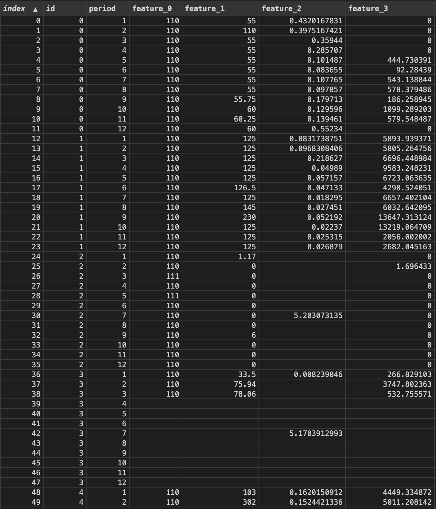
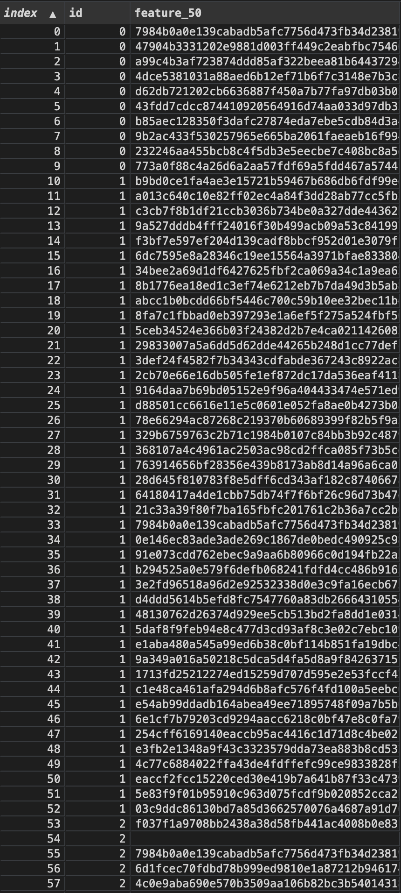
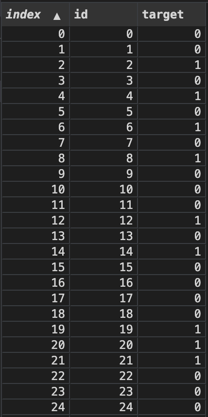
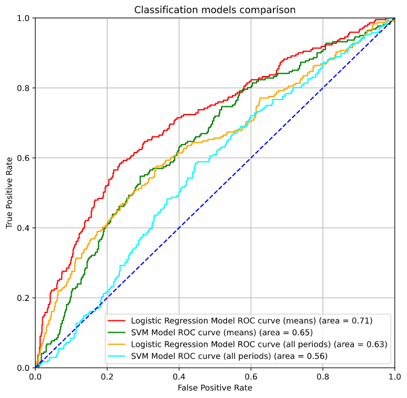

# Data science task to do a binary classification of cellular operator customers
All in-depth research and thought process can be found in ipynb file 

I'll give a short description of the task below

## Initial data
We have data files:
* tabular_data.csv
* hashed_feature.csv
* train.csv
* test.csv

`tabular_data` and `hashed_feature` contain features data for 4084 customers, where "id" is client's identifier, "period" - data period, "feature_1, 2 .. 49" contain feature about client's activities.
Part of the tabular_data file:

  

I'm not given any information on what do those encoded "features" mean, but it can be assumed they are something like this:

  

hashed_feature file:
 

   
 

`train` file contains labeled data (whether or not customer belong to 'car driver' category)  
 

   
 

`test` file should be filled with results predicted by a model (this file will be submitted for review) 

## The task
First of all - initial data contains missed values, we have to deal with that. Also as is mentioned above - client data is located in two files. So one way is to merge them into one data frame to feed the model.

This is a task of binary classification. 1 - the customer is a car driver, 0 - the customer is not a car driver.
I built 2 models on 2 data frames and evaluated them (all details are in the file). Then I choose the most effective one for making predictions.
 

   
 

